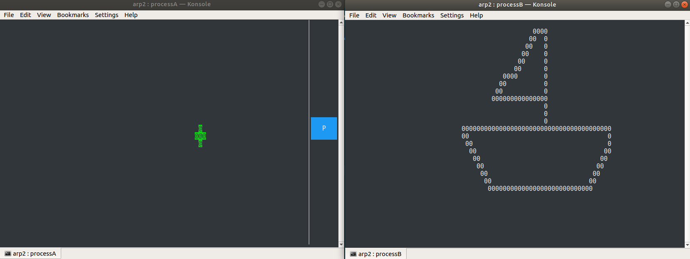

Deliverable by Miguel Angel Sempere Vicente and David Villanueva Álvarez.
Github: [https://github.com/scoobygalleta/ARP_1](https://github.com/scoobygalleta/arp2/)

# Requirements
To compile the application it is required:
* ncurses library  
  under Ubuntu, it is possible to install it from command line:  
  `sudo apt install libncurses-dev`
* to use the application it is required that konsole from KDE is installed.  
  Under Ubuntu it is possible to install it from command line:  
  `sudo apt install konsole`.
* libbitmap library: follow the process specified in the given assignment description.

# Build and run application
In a shell, under the root directory of the project, type the following command:  
`./run.sh`  
It will compile the sources with the corresponding linkers under the directory `./src` and the binaries will be generated under the directory `./bin`. Then, the master process will run.

# Application behaviour
The application opens two windows (both 90x30 sized), one for processA and another one for processB. When the user moves the circle using the arrows from the keyboard in processA, the other window will show the path followed by the center of the circle since the program was launched. If button P in processA is pressed, a .bmp file is saved under the `./out` directory. An example of the program execution is shown above:

## Internal computation

Following the assignment description and specifications, processA has a bitmap local map. Each time a movement is detected in the ncurses window, the bitmap is erased, a circle is drawed into this same bitmap on the coordinates given by the ncurses window (factor x20), and the values from the bitmap are copied into the shared memory map (`/BITMAP`), which is a matrix sized 1600x600 (same as the bitmap). It is important to remark that the bitmap map in processB is not needed, as the center can be directly extracted from the matrix. This second process is constantly checking if the center of the circle in the shared memory matrix has changed and, if it is the case, saves the coordinates (factor /20) and updates the center of the local ncurses window. In order to extract the center of the "shared" circle, processB must iterate though each position of the matrix and look for occupied segments that match with the cicle diameter. If the previous found center is the same as the current one, nothing changes. An array of visited positions (array of coordinate structs) is used to keep track of the path and be able to reprint it on every iteration and when the screen is resized as well. The whole program is divided in functions for sake of clarity, and comments are used to explain shortly the behaviour of the code.

Even though one process is writing and the other one is reading from the shared memory, semaphores are used to avoid possible issues as reading outdated information from the map. One semaphore is used for the writer in processA (`/sem_BITMAP_writer`) and another one for the reader in processB (`/sem_BITMAP_reader`). 

Return values from already implemented functions are treated correctly, if an error is detected, a perror is launched to inform the user, and then the program is ended. On a regular execution of the program, all the files, file descriptors, semaphores, etc are closed at termination.

## Log files
Each created process will write a log file under the directory `./logs`.  
These files, if already present, will be overwritten. This can be modified as desired when opening the file, just by changing the *w* paramenter when opening the file. If *a* is selected, all new entries will be appended to the relative existing files.  
Each process will log whenever an event occurs, when the print button is pressed, when the circle in processA is moved, when processB registers a new movement in the shared map, when semaphore is locked and when it is unlocked.

